# Student Portal - React Router v6 Assignment


---

## Project Overview

The Student Portal is a responsive web application built with React and React Router v6. It demonstrates core routing concepts including basic navigation, dynamic routing, protected routes, nested routes, and programmatic redirection.

---

## Features Implemented

- **Navigation:** Built using `Link` and `NavLink` (no traditional anchor tags).
- **Dynamic Routing (`/courses/:id`):** Displays specific course details using the `useParams()` hook.
- **Role-Based Authentication:** Users can log in as a `Student` or `Admin`.
- **Programmatic Redirection:** Handled via the `useNavigate()` hook upon login.

### Protected Routes
- Unauthenticated users are redirected to the Login page.
- Users attempting to access the wrong dashboard receive an "Unauthorized Access" message.

### Nested Routing (via `<Outlet />`)
- **Student Dashboard**
  - Profile
  - Enrolled Courses
- **Admin Dashboard**
  - Add Course
  - Manage Enrollments

- **404 Handling:** A custom "Page Not Found" component for invalid URLs.
- **Data Persistence:** Uses LocalStorage to save courses, user sessions, and enrollments across page reloads.

---

## Screenshots

### 1. Home Page & Navigation Bar
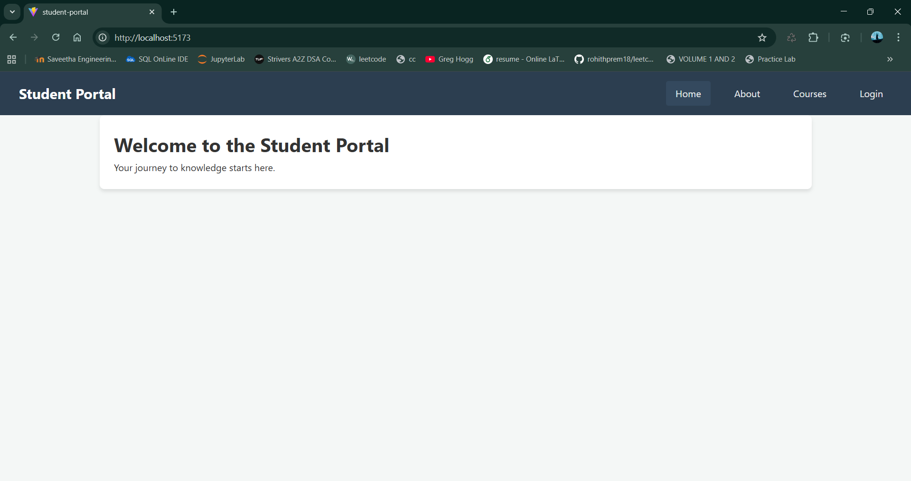

### 2. Login System & Role Selection
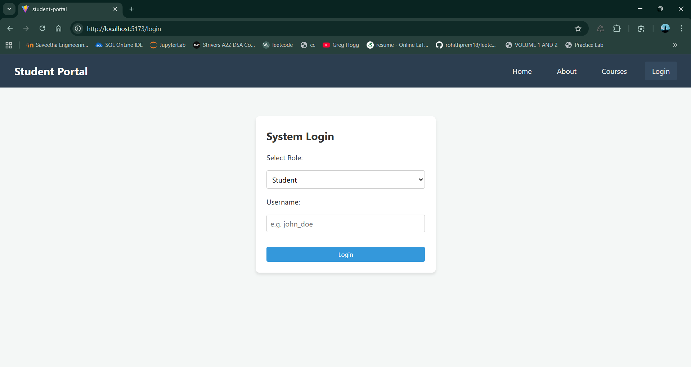

### 3. Courses Page (List of 5 or More Courses)
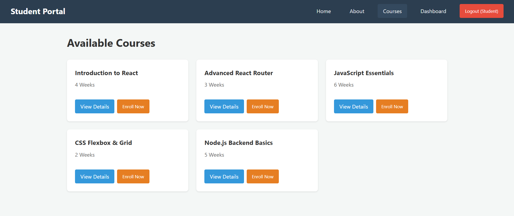

### 4. Dynamic Routing (Course Details)
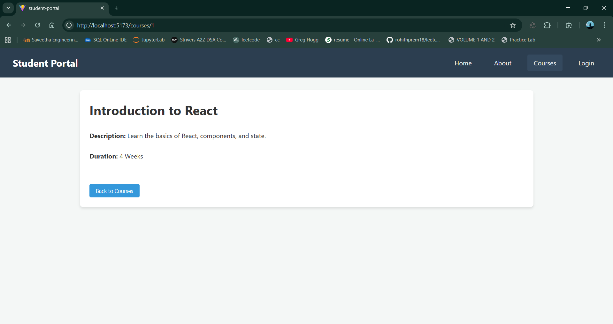

### 5. Student Dashboard (Protected & Nested Routes)
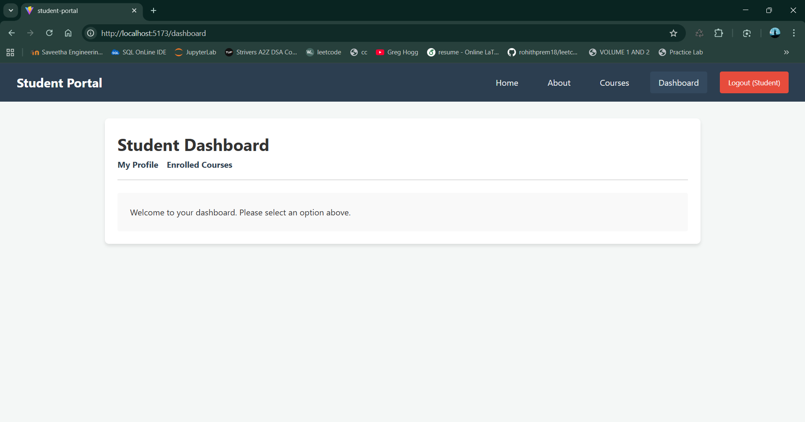
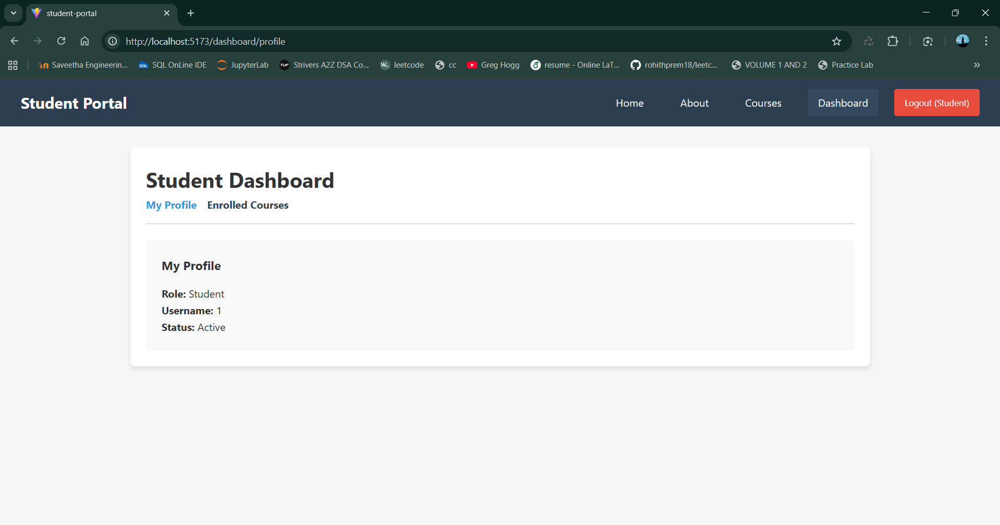
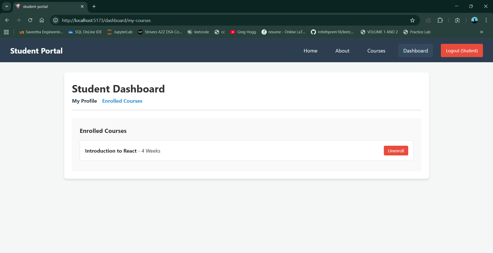

### 6. Admin Dashboard (Protected & Nested Routes)
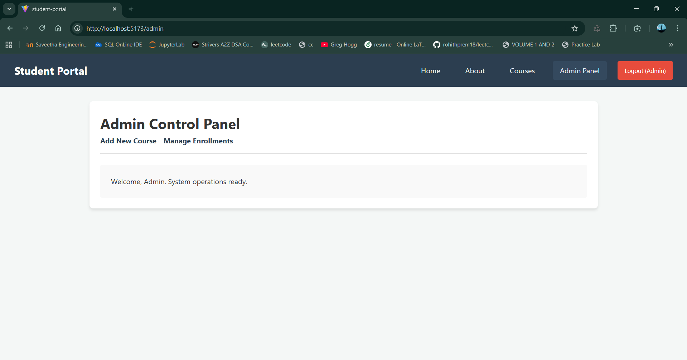
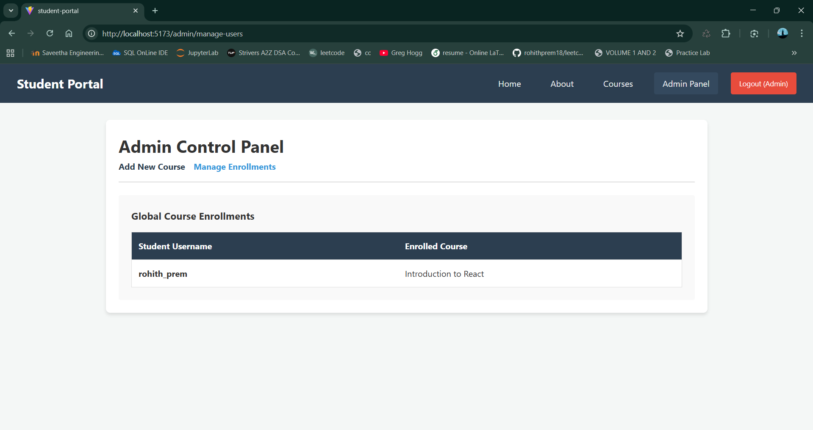
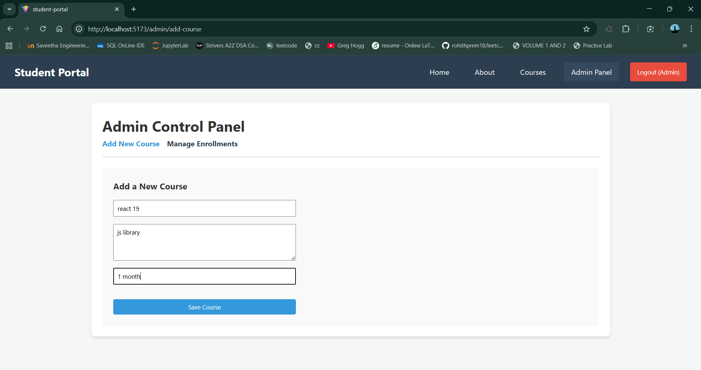

### 7. Unauthorized Access Handling

Displays an error if a logged-in user tries to access a route not permitted for their role (for example, Student trying to access `/admin`).

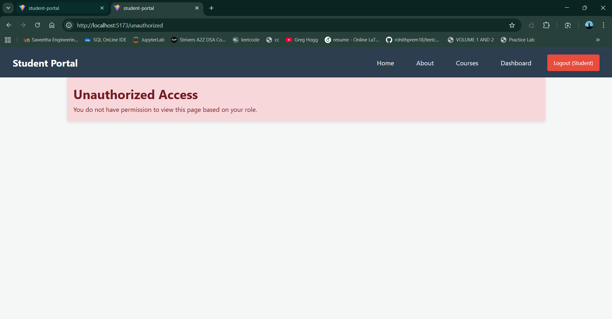

### 8. Invalid URL Handling (404 Page Not Found)
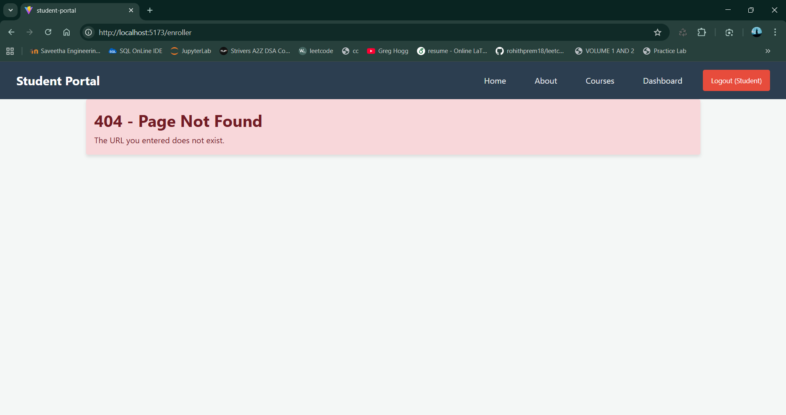

## How to Run the Project

### Prerequisites
- Node.js (v16 or higher recommended)
- npm (comes with Node.js)

### Installation Steps

1. Clone the repository:

```bash
git clone https://github.com/rohithprem18/student-portal
```

2. Navigate into the project directory:

```bash
cd student-portal
```

3. Install dependencies:

```bash
npm install
```

4. Start the development server:

```bash
npm run dev
```

5. Open your browser and visit:

```
http://localhost:5173
```

---

## Build for Production

To create an optimized production build:

```bash
npm run build
```

---

## Conclusion

This project successfully demonstrates practical implementation of React Router v6 concepts including protected routes, nested routing, dynamic routing, and role-based access control in a structured and scalable manner.